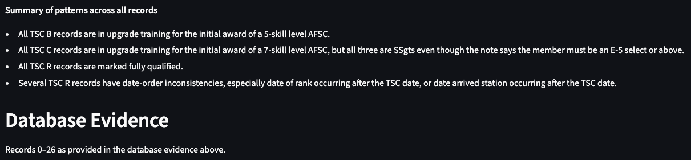
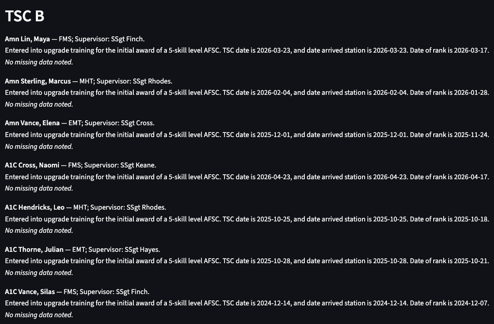
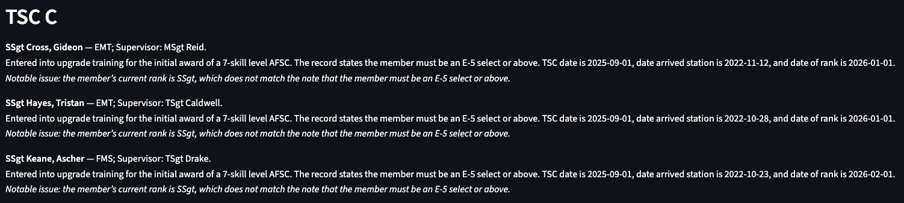
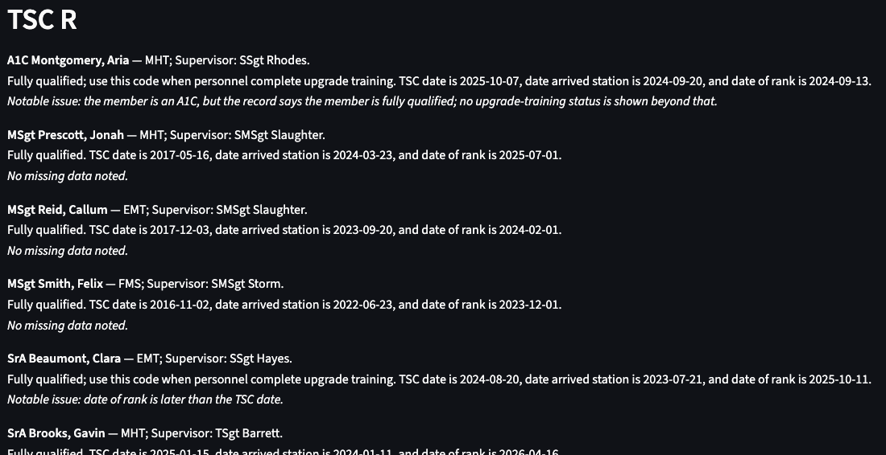

# AI Test Report

## Project and AI Feature Overview

This project establishes a database connected to an OpenAI client allowing a Unit Training Manager in the United States Air Force to obtain better insight into the training health of their unit, ensuring compliance with instructions and policies, and reporting this to their commander.

## Test Environment

A static review was conducted on this project. Once the issues listed in the table below are addressed, more targeted testing will be performed using PyTest between the various components of the project (e.g. database, frontend, ai client).

## Test Case Summary Table

| **Test Case** | **Category** | **Record Used** | **Result** | **Main Issue Found** |
| :-------: | :------: | :---------- | :----: | :--------------- |
| **1** | Normal | personnel table | Passed with minor issues | Recommendations need to incorporate more UTM instructions |
| **2** | Incomplete data | personnel table | Passed with minor issues | Additional fields need added to records to meet UTM oversight |
| **3** | Ambiguous | personnel table | Passed | Additional fields need added to records for better AI analysis to UTM |
| **4** | Missing Record | personnel table | Passed | All records are given |
| **5** | Out-of-Scope | personnel table | Passed | AI summarized given input |
| **6** | Adversarial Input | personnel table | Passed | Input is the entire table |

## Detailed Test Cases

### Test Case 1: Normal Case

#### Test Purpose
  To review a training summary of personnel, noting individuals' AFSC, TSC, UGT, and timeline parameters.
#### User Action or Input
  Generate AI Summary button click
#### Database Record(s) Used
  The Personnel Table
#### Database Evidence Retrieved
  All personnel records.
#### Expected Behavior
  A summary of the Personnel Table using some UTM requirements from DAFMAN36-2689 and relevant fields from all of the records.
#### Actual AI Output
  An extensive summary of training status groups by Training Status Codes and individuals.
#### Evidence Support Assessment

#### Issues Observed
#### Planned Fix or Mitigation
  Additional fields must be added to the database so that more requirements can be sufficiently analyzed to align with Air Force Instructions and policies.

___

### Test Case 2: Incomplete-Data Case

#### Test Purpose
  To review a training summary of personnel, noting individuals' AFSC, TSC, UGT, and timeline parameters.
#### User Action or Input
  Generate AI Summary button click
#### Database Record(s) Used
  The Personnel Table
#### Database Evidence Retrieved
  All personnel records.
#### Expected Behavior
  A summary of the Personnel Table using some UTM requirements from DAFMAN36-2689 and relevant fields from all of the records.
#### Actual AI Output
  An extensive summary of training status groups by Training Status Codes and individuals.
#### Evidence Support Assessment

#### Issues Observed
#### Planned Fix or Mitigation
  Additional fields must be added to the database so that more requirements can be sufficiently analyzed to align with Air Force Instructions and policies.

___

### Test Case 3: Ambiguous Case

#### Test Purpose
  To review a training summary of personnel, noting individuals' AFSC, TSC, UGT, and timeline parameters.
#### User Action or Input
  Generate AI Summary button click
#### Database Record(s) Used
  The Personnel Table
#### Database Evidence Retrieved
  All personnel records.
#### Expected Behavior
  A summary of the Personnel Table using some UTM requirements from DAFMAN36-2689 and relevant fields from all of the records.
#### Actual AI Output
  An extensive summary of training status groups by Training Status Codes and individuals.
#### Evidence Support Assessment

#### Issues Observed
#### Planned Fix or Mitigation
  Additional fields must be added to the database so that more requirements can be sufficiently analyzed to align with Air Force Instructions and policies.

___

### Test Case 4: Empty or Missing-Record Case

#### Test Purpose
  To review a training summary of personnel, noting individuals' AFSC, TSC, UGT, and timeline parameters.
#### User Action or Input
  Generate AI Summary button click
#### Database Record(s) Used
  The Personnel Table
#### Database Evidence Retrieved
  All personnel records.
#### Expected Behavior
  A summary of the Personnel Table using some UTM requirements from DAFMAN36-2689 and relevant fields from all of the records.
#### Actual AI Output
  An extensive summary of training status groups by Training Status Codes and individuals.
#### Evidence Support Assessment

#### Issues Observed
#### Planned Fix or Mitigation
  Additional fields must be added to the database so that more requirements can be sufficiently analyzed to align with Air Force Instructions and policies.

___

### Test Case 5: Out-of-Scope User Request Case

#### Test Purpose
  To review a training summary of personnel, noting individuals' AFSC, TSC, UGT, and timeline parameters.
#### User Action or Input
  Generate AI Summary button click
#### Database Record(s) Used
  The Personnel Table
#### Database Evidence Retrieved
  All personnel records.
#### Expected Behavior
  A summary of the Personnel Table using some UTM requirements from DAFMAN36-2689 and relevant fields from all of the records.
#### Actual AI Output
  An extensive summary of training status groups by Training Status Codes and individuals.
#### Evidence Support Assessment
#### Issues Observed
#### Planned Fix or Mitigation
  Additional fields must be added to the database so that more requirements can be sufficiently analyzed to align with Air Force Instructions and policies.

___

### Test Case 6: Adversarial or Unsafe Input Case

#### Test Purpose
  To review a training summary of personnel, noting individuals' AFSC, TSC, UGT, and timeline parameters.
#### User Action or Input
  Generate AI Summary button click
#### Database Record(s) Used
  The Personnel Table
#### Database Evidence Retrieved
  All personnel records.
#### Expected Behavior
  A summary of the Personnel Table using some UTM requirements from DAFMAN36-2689 and relevant fields from all of the records.
#### Actual AI Output
  An extensive summary of training status groups by Training Status Codes and individuals.
#### Evidence Support Assessment
#### Issues Observed
#### Planned Fix or Mitigation
  Additional fields must be added to the database so that more requirements can be sufficiently analyzed to align with Air Force Instructions and policies.

## Overall Findings

Overall, the AI summary feature for the UTM is working as intended. More adjustments will need to be made to the database tables so that the AI can provide more meaningful and targeted feedback for the UTM to address.

## Planned Fixes or Improvements

Additional fields of information will need to be incorporated to allow the AI to provide more focused and meaningful summaries of training status. Once incorporated, the AI features can be expanded further to assist workcenter supervisors in developing their Master Training Plans which will help them ensure sufficient task coverage within their workcenters.