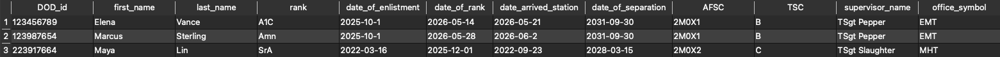
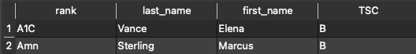
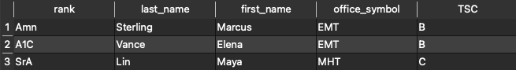
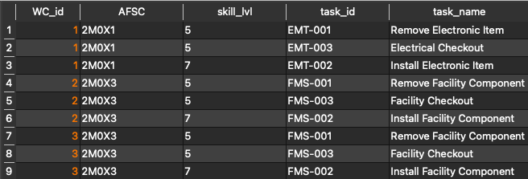
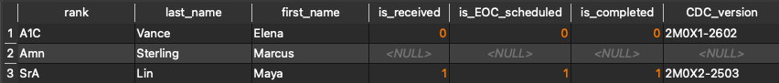
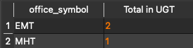

# Query Portfolio

NOTE: I used the database management tool, Valentina Studio, to view my database and acquire snapshots. This was also helpful in graphically building up the remaining child tables that required references to the parent tables (e.g. MTL -> MTP -> workcenter).

### 1. Basic SELECT query

Purpose: This returns a list of all records from the personnel table including every column.

```sql
SELECT *
FROM personnel;
```


All details regarding personnel information are displayed here.

### 2. Filtered WHERE query

Purpose: Filtering personnel on their Training Status Code allows for clearer viewing of applicable trainee information.

```sql
SELECT rank, last_name, first_name, TSC
FROM personnel
WHERE TSC = 'B';
```



This is a filtered view of all trainees in 5-lvl training (i.e. TSC = 'B')

### 3. ORDER BY or LIMIT query

Purpose: This returns a list of trainees that is more readable. Names are listed first by associated workcenter, then by last name.

```sql
SELECT rank, last_name, first_name, office_symbol, TSC
FROM personnel
ORDER BY office_symbol, last_name;
```



This list of trainees has been ordered by workcenter then by last name.

### 4. JOIN query #1

Purpose: This returns all tasks associated with a master training plan per AFSC.

```sql
SELECT mtp.WC_id, mtp.AFSC, mtl.skill_lvl, mtl.task_id, mtl.task_name
FROM master_training_plan AS mtp
LEFT JOIN master_task_list as mtl
  ON mtp.AFSC = mtl.AFSC;
```



This view allows to see the tasks associated with each workcenter's MTP.

### 5. JOIN query #2

Purpose: This returns all personnel that have their CDCs ordered to display receipt and completion as applicable.

```sql
SELECT p.rank, p.last_name, p.first_name, cdc.is_received, cdc.is_EOC_scheduled, cdc.is_completed, cdc.CDC_version
FROM personnel AS p
LEFT JOIN career_dev_courses as cdc
  ON p.DOD_id = cdc.DOD_id;
```



This view joins CDC order information to the student. Student's that reflect \<NULL\> in the CDC fields indicate that CDCs have not been ordered or updated. 

### 6. Aggregation query

Purpose: This returns the count of all Airmen in 5-lvl or 7-lvl upgrade training.

```sql
SELECT COUNT(TSC)
FROM personnel
WHERE TSC = 'B' OR TSC = 'C';
```


This view displays the total count of all trainees in upgrade training.

### 7. GROUP BY query

Purpose: This returns a count of trainees in 5-lvl or 7-lvl upgrade training grouped by workcenter.

```sql
SELECT office_symbol, count(*) AS 'Total in UGT'
FROM personnel
WHERE TSC = 'B' OR TSC = 'C'
GROUP BY office_symbol;
```



This view lists the number of personnel in UGT per workcenter.

### 8. Data validation or AI-support retrieval query

Purpose: This returns a list of individuals who need their CDCs ordered. The workcenter and supervisor name are provided for contact.

```sql
SELECT p.rank, p.last_name, p.first_name, cdc.order_date, p.office_symbol, p.supervisor_name
FROM personnel AS p
LEFT JOIN career_dev_courses as cdc
  ON p.DOD_id = cdc.DOD_id
WHERE cdc.CDC_order_id IS NULL;
```


This displays an individual who has not had their CDCs ordered yet.