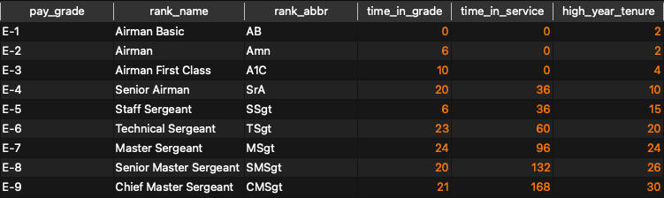
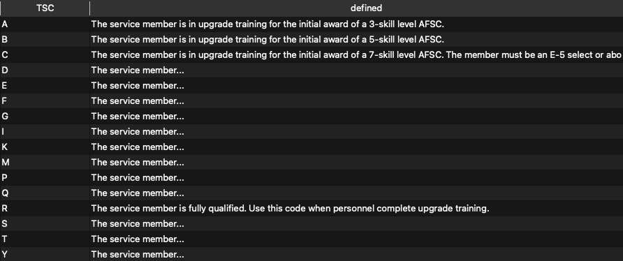
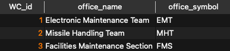
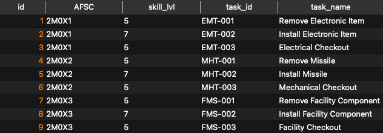
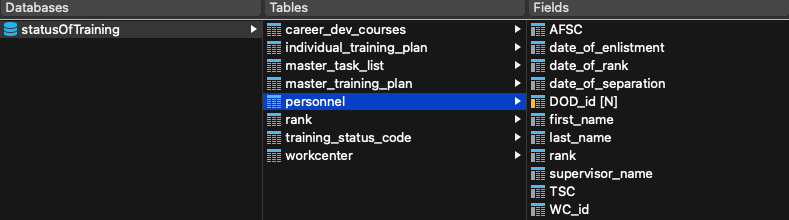

# Basic Verification Queries

### Ranks

This will display all 9 enlisted ranks in this table.

```sql
SELECT * 
FROM rank;
```



### Status Training Codes

This will display all 16 training status codes in this table.

```sql
SELECT * 
FROM training_status_code;
```



### Work Centers

This will display all 3 work centers in this table.

```sql
SELECT * 
FROM workcenter;
```



### Master Training Tasks

This will display all 9 training tasks list so far in this table.

```sql
SELECT * 
FROM master_task_list;
```



### Remaining Tables

Due to the interrelationships between the remaining tables and arbitrary record id values created via autoincrementation, I believe it will be more productive to connect the GUI to the database to add records to these fields. Functionality will be adjusted as required. 

